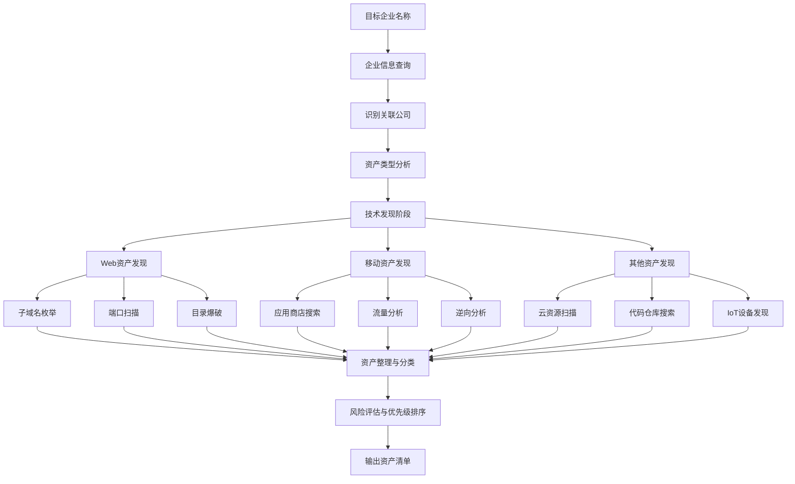

# 业务资产信息收集

业务资产信息收集是渗透测试和网络安全评估的第一步，目的是全面识别目标组织在互联网上暴露的所有数字资产。这些资产可能包括网站、移动应用、API服务、服务器、云服务等。全面发现业务资产有助于确定攻击面范围，为后续漏洞扫描和渗透测试奠定基础。

## 1. 企业信息查询平台

在开始技术资产发现之前，通常需要先了解目标企业的基本信息，包括公司全称、子公司、关联企业、品牌、产品线等。以下是一些常用的企业信息查询平台：

### 1.1 企查查 (qichacha.com)
企查查是国内权威的企业信息查询平台，收录了全国企业信用信息，特别适用于国内目标。

**主要功能：**
- **企业基本信息查询**：公司名称、注册资本、成立时间、法定代表人、经营范围
- **股权结构分析**：股东信息、投资关系、控股子公司
- **关联企业发现**：通过法人、股东、投资关系发现关联公司
- **知识产权查询**：商标、专利、软件著作权等信息
- **风险信息筛查**：行政处罚、诉讼记录、失信信息

**使用示例：**
```
1. 访问 https://www.qichacha.com
2. 在搜索框输入目标公司名称（如"北京字节跳动科技有限公司"）
3. 查看公司基本信息页面
4. 点击"股东信息"、"对外投资"等标签页发现关联企业
5. 记录所有发现的子公司、关联公司名称用于后续资产发现
```

**搜索技巧：**
- 使用模糊搜索：如果目标公司全称不确定，可使用简称或品牌名搜索
- 关注控股比例：优先调查控股比例高的子公司
- 查看分支机构：注意分公司、办事处等非独立法人实体
- 时间维度分析：查看企业历史变更记录，可能发现已注销但仍有资产遗留的子公司

### 1.2 小蓝本 (xiaolanben.com)
小蓝本是专业的企业情报和商业查询平台，提供更深入的商业关系分析。

**特色功能：**
- **高管团队信息**：详细的企业高管背景、任职经历
- **产业链分析**：上下游企业关系网络
- **投融资信息**：融资历史、投资机构、估值信息
- **竞品分析**：同行业竞争对手识别
- **工商变更监控**：实时跟踪企业工商信息变更

**应用场景：**
- 识别目标企业的技术合作伙伴、云服务提供商
- 发现通过投资关系关联的技术公司
- 了解企业技术团队背景（CTO、技术总监的技术偏好）
- 分析企业的技术生态链

### 1.3 其他查询平台
- **天眼查 (tianyancha.com)**：功能类似企查查，数据源略有差异，可交叉验证
- **国家企业信用信息公示系统**：官方权威数据，但查询体验较差
- **国外平台**：对于跨国公司，可使用 LinkedIn、Crunchbase、ZoomInfo 等

## 2. 业务资产类型识别

识别企业业务资产类型是信息收集的核心环节。不同类型的资产需要采用不同的发现技术和测试方法。

### 2.1 Web应用
Web应用是最常见的业务资产，包括官网、业务系统、管理后台、API接口等。

**特征识别：**
- 标准HTTP/HTTPS协议（80/443端口）
- 通过浏览器访问的交互式界面
- 通常有登录表单、数据提交功能
- 使用HTML/CSS/JavaScript技术栈

**发现方法：**
1. **子域名枚举**：使用工具如OneForAll、subfinder、amass
   ```bash
   # 使用OneForAll进行子域名收集
   python3 oneforall.py --target example.com run
   
   # 使用subfinder
   subfinder -d example.com -o subdomains.txt
   ```
2. **端口扫描**：针对Web常用端口（80,443,8080,8443等）
   ```bash
   nmap -p 80,443,8080,8443,8888 -iL targets.txt
   ```
3. **搜索引擎语法**：
   - `site:example.com` 搜索所有相关页面
   - `inurl:admin site:example.com` 查找管理后台
   - `intitle:"login" site:example.com` 查找登录页面

**常见Web资产类型：**
- 官方网站（品牌宣传）
- 客户门户（用户登录系统）
- 管理后台（内部管理系统）
- 电子商务平台
- API网关和微服务
- 文档系统（Confluence、Wiki等）
- 监控面板（Grafana、Kibana等）

### 2.2 APP应用 (移动应用)
移动应用包括Android和iOS平台的应用，可能通过官方应用商店或企业内部分发。

**发现渠道：**
- **官方应用商店**：App Store、Google Play、华为应用市场、小米应用商店等
- **第三方应用市场**：应用宝、360手机助手、豌豆荚等
- **企业官网**：通常在"下载中心"或"移动端"栏目
- **APK反编译资源**：部分应用可能泄露内部域名、API地址

**信息收集要点：**
1. **应用基本信息**：包名、版本号、开发商、更新时间
2. **权限分析**：应用申请的敏感权限（网络、存储、位置等）
3. **网络流量分析**：抓包分析API通信（使用BurpSuite、Fiddler）
4. **静态分析**：反编译APK/IPA文件，查找硬编码的URL、密钥
5. **服务端关联**：通过API域名发现对应的Web服务

**工具推荐：**
- **MobSF (Mobile Security Framework)**：自动化移动应用安全测试平台
- **JADX**：Android应用反编译工具
- **Frida**：动态插桩框架，用于运行时分析
- **BurpSuite Mobile Assistant**：移动端流量抓包

### 2.3 PC客户端应用
桌面客户端应用包括Windows、macOS、Linux平台的安装程序。

**特征：**
- 通常为.exe、.msi、.dmg、.deb、.rpm等格式
- 可能包含自动更新功能（更新服务器地址）
- 可能内嵌WebView组件（混合应用）
- 可能与云服务或API通信

**发现方法：**
- 企业官网的"下载中心"或"客户端下载"页面
- 软件下载站（CNET、Softonic、国内各种下载站）
- GitHub/GitLab上的开源客户端项目
- 通过搜索引擎：`"download" "windows" site:example.com`

**安全测试要点：**
- 更新机制安全性（更新包是否签名验证）
- 本地数据存储安全性（配置文件、数据库）
- 进程间通信安全性
- 与服务器通信的加密实现

### 2.4 小程序应用
微信小程序、支付宝小程序、百度小程序等轻量级应用。

**特性：**
- 无需安装，即用即走
- 运行在超级App（微信、支付宝）的沙箱环境中
- 前端逻辑+云函数架构
- 通常有对应的管理后台

**发现方法：**
1. **微信小程序**：
   - 微信搜索目标企业名称或相关关键词
   - 通过企业微信公众号关联的小程序入口
   - 第三方小程序数据平台（阿拉丁、知晓程序）
   
2. **技术分析**：
   - 使用微信开发者工具调试小程序
   - 分析小程序包（wxapkg文件）获取API信息
   - 抓取小程序网络请求（需配置代理）

**安全关注点：**
- 云函数权限配置
- API接口鉴权机制
- 小程序代码混淆程度
- 敏感信息硬编码问题

### 2.5 微信公众号
微信公众号是企业重要的数字资产，包括订阅号、服务号、企业微信。

**类型区分：**
- **订阅号**：主要用于信息推送，每天可群发1条消息
- **服务号**：提供更多交互功能，支持微信支付、模板消息等
- **企业微信**：企业内部管理和外部客户联系工具

**信息收集内容：**
- 公众号基本信息：名称、ID、认证主体、功能介绍
- 菜单栏结构：暴露的功能入口（可能跳转到Web应用）
- 历史文章：可能泄露内部信息、招聘信息（技术栈线索）
- 自动回复：关键词自动回复可能暴露后台系统

**关联资产发现：**
- 公众号绑定的自定义菜单通常指向企业网站或Web应用
- 微信支付商户号可能关联其他电商系统
- 小程序与公众号的关联关系

### 2.6 其他数字产品
除了上述常见类型，企业可能还拥有以下数字资产：

**物联网(IoT)设备：**
- 智能硬件设备（摄像头、路由器、智能家居）
- 嵌入式系统Web界面（通常端口8080、8888）
- 发现方法：Shodan、Censys搜索企业IP段

**云服务资源：**
- 云存储桶（AWS S3、阿里云OSS、腾讯云COS）
- 云函数/Serverless服务
- 容器镜像仓库
- 发现方法：针对云服务特征扫描，使用工具如CloudBrute、S3Scanner

**API服务：**
- RESTful API、GraphQL接口
- SOAP Web Services
- gRPC服务
- 发现方法：从Web/App流量中提取，使用工具如Arjun、Kiterunner

**开发资源：**
- 代码仓库（GitHub、GitLab、Gitee）
- 文档系统（Confluence、语雀、Notion）
- CI/CD系统（Jenkins、GitLab CI、GitHub Actions）
- 发现方法：搜索引擎语法、GitHub搜索、特定端口扫描

## 3. 资产发现工作流程

一个系统化的业务资产发现工作流程如下：



### 3.1 初始信息收集阶段
1. **确定目标范围**：明确测试授权范围（哪些公司、哪些域名/IP段）
2. **企业信息查询**：使用企查查、小蓝本等平台获取企业基本信息
3. **关联企业识别**：发现子公司、投资公司、品牌关联
4. **品牌和产品线**：收集目标企业的品牌名称、产品名称、服务名称

### 3.2 技术资产发现阶段
1. **域名资产发现**：
   - 主域名、子域名收集
   - DNS历史记录查询（DNSdumpster、SecurityTrails）
   - 证书透明度日志（crt.sh、CertSpotter）
   
2. **IP资产发现**：
   - ASN（自治系统号）查询
   - IP段归属分析
   - 历史IP地址查询
   
3. **端口与服务扫描**：
   - 全端口扫描（masscan）
   - 服务识别（nmap -sV）
   - 漏洞初步筛查（nmap --script vuln）

4. **Web资产深度发现**：
   - 目录和文件枚举（dirsearch、gobuster）
   - 参数发现（Arjun、ParamSpider）
   - JS文件分析（LinkFinder、JSFinder）

### 3.3 资产整理与验证
1. **去重与整理**：合并来自不同来源的发现结果
2. **资产分类**：按类型（Web、API、移动端等）和组织结构分类
3. **存活验证**：检查资产是否可访问，去除无效条目
4. **指纹识别**：识别技术栈（Wappalyzer、WhatWeb）
5. **截图存档**：保存每个Web资产的截图（EyeWitness、Aquatone）

### 3.4 风险评估与优先级
1. **暴露面分析**：哪些资产面向互联网，哪些在内网
2. **重要性评估**：核心业务系统 vs 边缘系统
3. **安全态势评估**：是否存在明显安全漏洞
4. **测试优先级排序**：确定重点测试目标

## 4. 实用工具推荐

### 4.1 综合信息收集工具
- **OneForAll**：强大的子域名收集工具，整合多个数据源
- **Amass**：全面的攻击面映射和资产发现工具
- **theHarvester**：电子邮件、子域名、虚拟主机收集

### 4.2 专项发现工具
- **subfinder**：快速子域名枚举工具
- **masscan**：最快的端口扫描器
- **nmap**：功能全面的网络探测和安全审计工具
- **dirsearch**：Web路径扫描工具
- **Arjun**：HTTP参数发现工具

### 4.3 可视化与整理工具
- **Aquatone**：子域名扫描结果可视化工具
- **EyeWitness**：自动化截取网站截图工具
- **TomNomNom工具集**：各种实用的小工具（httprobe、anew等）

### 4.4 在线平台与资源
- **Shodan**：物联网设备搜索引擎
- **Censys**：互联网设备搜索引擎
- **FOFA**：国内优秀的网络空间资产搜索引擎
- **ZoomEye**：知道创宇的网络空间搜索引擎

## 5. 最佳实践与注意事项

### 5.1 法律与授权
- **始终获取授权**：在测试前确保获得书面授权
- **遵守测试范围**：严格按照授权范围进行测试，不越界
- **注意隐私保护**：不收集、存储或泄露个人隐私信息
- **遵守法律法规**：了解当地网络安全法律法规

### 5.2 技术操作注意事项
1. **控制扫描频率**：避免过快的扫描导致目标服务不可用或被封IP
2. **使用代理池**：大规模扫描时使用代理避免IP封锁
3. **保存完整日志**：记录所有操作步骤，便于复现和报告编写
4. **验证发现结果**：自动化工具可能有误报，需要手动验证重要资产
5. **注意隐蔽性**：根据测试类型（白盒/灰盒/黑盒）调整扫描的隐蔽程度

### 5.3 效率优化技巧
1. **并行执行**：使用工具如`xargs`、`parallel`或自己编写脚本实现并行扫描
2. **结果去重**：使用`sort -u`、`anew`等工具去除重复结果
3. **增量扫描**：定期执行扫描时，只扫描新增资产或变化部分
4. **自动化流水线**：将多个工具串联，构建自动化信息收集流水线

### 5.4 报告与交付
- **资产清单**：提供完整的、分类清晰的资产清单
- **发现方法**：记录使用的工具和技术，便于客户验证
- **风险评估**：对发现的资产进行初步风险评估
- **改进建议**：针对资产发现流程本身提出改进建议

## 6. 实战案例：某电商企业资产发现

### 6.1 目标背景
某电商企业"优购科技"，主要业务为B2C电商平台，拥有官方网站、移动App、微信小程序等多种数字资产。

### 6.2 信息收集过程
1. **企业信息查询**：
   - 企查查搜索"优购科技"，发现3家子公司
   - 小蓝本分析高管团队，发现CTO有技术博客，提及使用React和Node.js技术栈

2. **域名资产发现**：
   - 主域名：yougou.com
   - 通过OneForAll发现子域名：api.yougou.com, admin.yougou.com, m.yougou.com, cdn.yougou.com
   - 证书透明度日志发现：dev.yougou.com, test.yougou.com

3. **移动资产发现**：
   - App Store搜索"优购"，找到官方购物App
   - 微信搜索"优购"公众号和小程序
   - 官网找到Android APK下载链接

4. **其他资产发现**：
   - GitHub搜索"yougou"发现员工个人账号泄露的内部代码片段
   - Shodan搜索ASN发现云服务器IP段
   - FOFA搜索"yougou.com"发现历史IP地址

### 6.3 发现结果总结
- **Web资产**：主站、管理后台、API服务、移动端H5、CDN服务
- **移动资产**：iOS App、Android App、微信小程序
- **云资源**：AWS S3存储桶（配置错误可公开访问）
- **开发资产**：测试环境、开发文档、GitHub代码片段
- **风险资产**：暴露的管理后台、可公开访问的存储桶、测试环境

### 6.4 后续测试建议
1. 优先级测试暴露的管理后台和API接口
2. 测试移动App的通信安全和本地存储
3. 检查所有子域名的安全配置
4. 验证云存储桶的访问控制

---

**总结**：业务资产信息收集是系统性工程，需要结合企业信息查询和技术资产发现。全面、准确的资产清单是后续安全测试的基础。在实际操作中，应根据目标特点调整发现策略，并注意控制扫描行为对目标系统的影响。